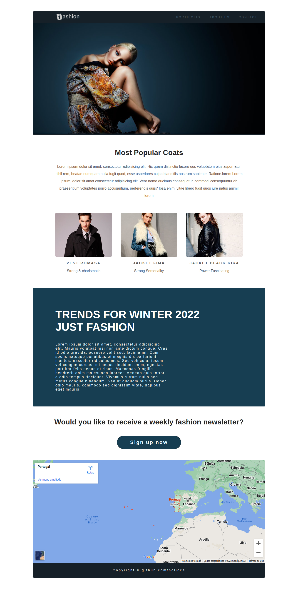

---

 

 

<h3 style="font-weight: bold">About 💻</h3>

---

This project was created using HTML and CSS. It is an informative section about fashion, of a clothing store website. At the bottom is the address of the store. This same project can be used for many different purposes.

 

<h3 style="font-weight: bold">Experiences 🧠</h3>

---

With the development of my first project I learned about styling, how to insert local images, links (like Google Maps), I got an introduction to displays, float, centering and others.

 

<h3 style="font-weight: bold">Author ✍🏼</h3>

---

My name is Holices, I am twenty years old, I am from Brazil and live in Portugal. Since I was very young I have been involved with technology (electronic games), so I decided to learn programming.

